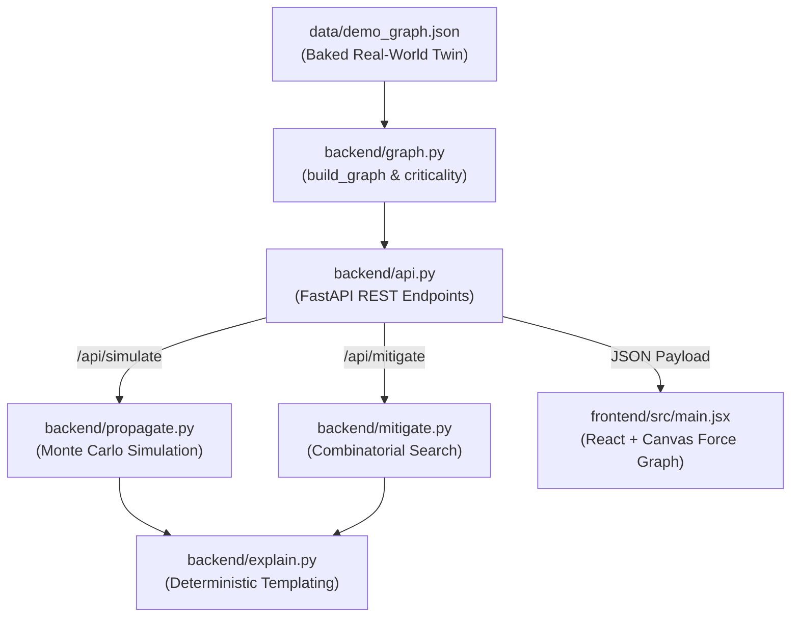
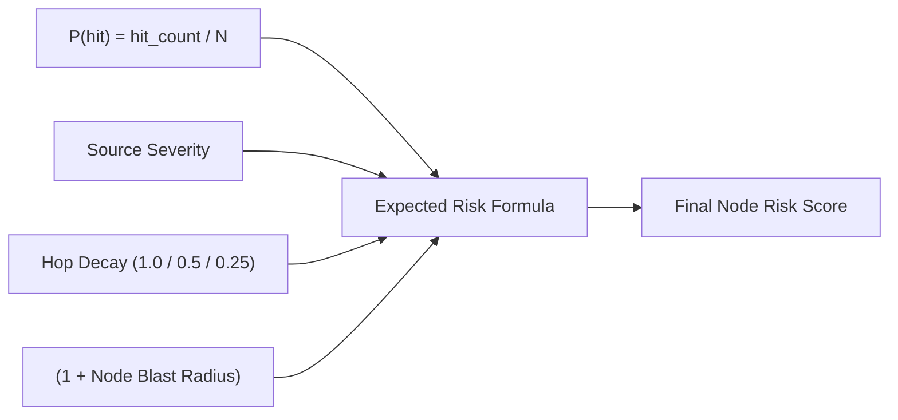

# System Architecture & Feature Reference

This document provides a comprehensive technical walkthrough of the **Supply Chain Ripple Risk Analyzer**. It details how the digital twin operates, how Monte Carlo propagation is executed, and how combinatorial mitigations and cost trade-offs are evaluated, with direct syntactic references to the codebase.

---

## 1. High-Level Architecture & Principles

The system addresses a fundamental limitation in traditional vulnerability management: **CVSS scores measure localized software flaw severity, but ignore structural topological blast radius in production supply chains.**



### Core Design Rules
1. **Zero Generative AI / LLM at Runtime:** Every metric, score, probability, and explanation string is calculated deterministically via graph mathematics, stochastic sampling, and string templates.
2. **Immutable Twin:** The base dependency graph (`GRAPH`) is strictly immutable. Simulations and hypothetical mitigations run exclusively on shallow copies (`graph.copy()`).
3. **Traceability:** No black-box scores. Every risk score and criticality ranking can be broken down into explicit arithmetic factors.

---

## 2. Digital Twin Data Model

The digital twin models the 2018 `event-stream` / `flatmap-stream` compromise on BitPay's Copay wallet. The graph is stored in [`data/demo_graph.json`](file:///Users/vishalsharan/tinkering_lab/mhash/Extremely_Vibecoded_Slop/data/demo_graph.json) and parsed in [`backend/graph.py`](file:///Users/vishalsharan/tinkering_lab/mhash/Extremely_Vibecoded_Slop/backend/graph.py).

### A. Heterogeneous Node Typing
Unlike a flat dependency manifest, the twin distinguishes between upstream software packages and downstream operational runtime environments:

```python
# In data/demo_graph.json:
# 1. Package Node:
{
  "id": "event-stream@3.3.6",
  "name": "event-stream",
  "version": "3.3.6",
  "type": "package",
  "ecosystem": "npm",
  "severity": 0.98,
  "cve_match": true,
  "is_direct": false,
  "maintainer_activity_score": 0.05
}

# 2. Service Node (Downstream runtime backend):
{
  "id": "copay-wallet-service",
  "name": "Copay wallet service",
  "type": "service",
  "criticality_tier": "critical",
  "redundancy": false,
  "environment": "prod"
}

# 3. Application Node (Downstream client):
{
  "id": "copay-mobile-app",
  "name": "Copay mobile app",
  "type": "application",
  "criticality_tier": "high",
  "redundancy": false,
  "environment": "prod"
}
```

### B. Typed Edges
Edges represent directional dependency flow ($A \to B$ indicates $B$ depends on or consumes $A$, meaning compromise propagates from $A$ to $B$):

```python
# In data/demo_graph.json:
{
  "source": "event-stream@3.3.6",
  "target": "flatmap-stream@0.1.1",
  "type": "depends_on",
  "dependency_scope": "runtime",
  "weight": 1.0,
  "base_probability": 0.88
}
```
Edge types include:
- `depends_on`: Direct library dependency between packages.
- `used_by`: A package embedded into a backend service or client app.
- `deployed_in`: A service powering a downstream application.

### C. Ingestion and Immutability Syntax ([`backend/graph.py#L18-L32`](file:///Users/vishalsharan/tinkering_lab/mhash/Extremely_Vibecoded_Slop/backend/graph.py#L18-L32))
```python
def build_graph() -> tuple[nx.DiGraph, dict]:
    data = load_data()
    graph = nx.DiGraph()
    graph.add_nodes_from((node["id"], node) for node in data["nodes"])
    graph.add_edges_from((link["source"], link["target"], link) for link in data["links"])
    centrality = nx.betweenness_centrality(graph, normalized=True)
    for node_id, attrs in graph.nodes(data=True):
        attrs["betweenness"] = round(centrality[node_id], 6)
        attrs["blast_radius"] = len(nx.descendants(graph, node_id))
        attrs["dependents_count"] = graph.in_degree(node_id)
        attrs["severity"] = float(attrs.get("severity", 0.0))
    return graph, data
```
- NetworkX's `nx.DiGraph` houses nodes and directed links.
- Structural metrics are pre-calculated at boot:
  - `attrs["betweenness"]`: Shortest-path bridge frequency.
  - `attrs["blast_radius"]`: Total downstream transitive descendants (`nx.descendants`).
  - `attrs["dependents_count"]`: In-degree (how many immediate components depend on this node).

---

## 3. Structural Criticality Ranking

**Purpose:** Identifies systemic architectural choke points independent of whether a node currently has an active CVE.

Located in [`backend/graph.py#L34-L45`](file:///Users/vishalsharan/tinkering_lab/mhash/Extremely_Vibecoded_Slop/backend/graph.py#L34-L45):

```python
TIER_WEIGHTS = {"low": 1.0, "medium": 2.0, "high": 3.0, "critical": 4.0}

def criticality_ranking(graph: nx.DiGraph) -> list[dict]:
    max_dependents = max((attrs["dependents_count"] for _, attrs in graph.nodes(data=True)), default=1) or 1
    ranked = []
    for node_id, attrs in graph.nodes(data=True):
        tier = TIER_WEIGHTS.get(attrs.get("criticality_tier", "low"), 0.0)
        redundancy_bonus = 0.0 if attrs.get("redundancy", True) else 0.25
        dependent_score = attrs["dependents_count"] / max_dependents
        score = attrs["betweenness"] * 4 + dependent_score * 2 + tier * 0.5 + redundancy_bonus
        ranked.append({
            "id": node_id,
            "name": attrs["name"],
            "type": attrs["type"],
            "severity": attrs["severity"],
            "score": round(score, 4),
            "breakdown": {
                "betweenness": attrs["betweenness"],
                "dependents_normalized": round(dependent_score, 4),
                "criticality_tier_weight": tier,
                "nonredundancy_bonus": redundancy_bonus
            }
        })
    return sorted(ranked, key=lambda item: item["score"], reverse=True)
```

### Mathematical Formula:
$$\text{Criticality Score} = 4 \times \text{Betweenness} + 2 \times \frac{\text{Dependents}}{\text{Max Dependents}} + 0.5 \times \text{Tier Weight} + \text{Non-Redundancy Bonus}$$

### Proving "Risk $\ne$ CVE Severity":
- A zero-severity node like `copay-wallet-service` (CVSS 0.0) ranks **#1** (`Score: 3.79`) because it has high betweenness (`0.0476`), 4 dependents, critical tier weight (`2.0`), and zero redundancy (`+0.25`).
- A high-severity node like `event-stream` (CVSS 9.8) ranks lower structurally (`Score: 0.0`) when it sits at the perimeter as a leaf with zero dependents.

---

## 4. The Monte Carlo Propagation Engine

Located in [`backend/propagate.py`](file:///Users/vishalsharan/tinkering_lab/mhash/Extremely_Vibecoded_Slop/backend/propagate.py).

Instead of applying an unrealistic deterministic decay, propagation models malware transmission across network links stochastically.

### A. Edge Probability Formula ([`backend/propagate.py#L9-L23`](file:///Users/vishalsharan/tinkering_lab/mhash/Extremely_Vibecoded_Slop/backend/propagate.py#L9-L23))

For each directed edge $(u \to v)$:
```python
def edge_probability(graph: nx.DiGraph, source: str, target: str, attrs: dict) -> float:
    source_attrs = graph.nodes[source]
    target_attrs = graph.nodes[target]
    probability = float(attrs.get("base_probability", 0.72)) * float(attrs.get("weight", 1.0))
    if attrs.get("dependency_scope", "runtime") != "runtime":
        probability *= 0.6
    if source_attrs.get("upgraded") or target_attrs.get("upgraded"):
        probability *= 0.05
    elif source_attrs.get("patched") or target_attrs.get("patched"):
        probability *= 0.15
    probability *= 0.75 + (1 - float(target_attrs.get("maintainer_activity_score", 0.5))) * 0.25
    if target_attrs.get("redundancy"):
        probability *= 0.48
    return round(min(0.98, max(0.0, probability)), 4)
```

#### Breakdown of Factors:
1. **Base Weight:** `base_probability * weight` (e.g., $0.88 \times 1.0 = 0.88$).
2. **Scope Penalty:** If dev/build dependency instead of runtime, multiplied by $0.6$.
3. **Mitigation Modifiers:**
   - If patched: Multiplied by $0.15$ (85% reduction in infection transmissibility).
   - If upgraded: Multiplied by $0.05$ (95% reduction in infection transmissibility).
4. **Target Maintainer Activity:** Neglected packages with low maintainer scores increase probability by up to $1.25\times$.
5. **Target Redundancy:** Redundant services reduce propagation likelihood ($\times 0.48$).
6. **Bounds:** Clamped between $[0.0, 0.98]$.

### B. Stochastic Simulation Loop ([`backend/propagate.py#L31-L52`](file:///Users/vishalsharan/tinkering_lab/mhash/Extremely_Vibecoded_Slop/backend/propagate.py#L31-L52))

```python
def propagate(graph: nx.DiGraph, compromised_id: str, trials: int = 800, seed: int | None = None) -> dict:
    active_graph = graph.copy()  # LIVE TWIN IS NEVER MUTATED
    rng = random.Random(seed)
    counts, hit_counts = [], {node_id: 0 for node_id in active_graph}

    for _ in range(trials):
        affected, queue = {compromised_id}, [compromised_id]
        while queue:
            source = queue.pop(0)
            for _, target, attrs in active_graph.out_edges(source, data=True):
                # Bernoulli trial on each edge traversal
                if target not in affected and rng.random() < edge_probability(active_graph, source, target, attrs):
                    affected.add(target)
                    queue.append(target)
        counts.append(len(affected) - 1)  # Exclude patient zero
        for node_id in affected:
            hit_counts[node_id] += 1
```

- In each trial, a standard Breadth-First Search (BFS) starts at `compromised_id`.
- For each adjacent downstream node, a random float $r \in [0, 1)$ is drawn. If $r < P(\text{edge})$, the target is infected and enqueued.
- Runs $N$ trials (default 800).

### C. Traceable Node Risk Scoring ([`backend/propagate.py#L53-L61`](file:///Users/vishalsharan/tinkering_lab/mhash/Extremely_Vibecoded_Slop/backend/propagate.py#L53-L61))

```python
    probabilities = {node_id: count / trials for node_id, count in hit_counts.items()}
    deterministic = nx.single_source_shortest_path_length(active_graph, compromised_id)
    severity = active_graph.nodes[compromised_id]["severity"]
    risks, breakdown = {}, {}
    for node_id, distance in deterministic.items():
        hop = max(1, distance)
        expected = probabilities[node_id] * severity * decay_for_hop(hop) * (1 + active_graph.nodes[node_id].get("blast_radius", 0))
        risks[node_id] = expected
        breakdown[node_id] = {
            "hop_distance": distance,
            "affected_probability": round(probabilities[node_id], 4),
            "expected_severity_contribution": round(expected, 4),
            "edge_path_rule": "base probability × maintainer activity × redundancy × edge weight"
        }
```



---

## 5. Mitigation & Combinatorial Cost Trade-off

Located in [`backend/mitigate.py`](file:///Users/vishalsharan/tinkering_lab/mhash/Extremely_Vibecoded_Slop/backend/mitigate.py).

### A. Four Distinct Mitigation Behaviors ([`backend/mitigate.py#L19-L34`](file:///Users/vishalsharan/tinkering_lab/mhash/Extremely_Vibecoded_Slop/backend/mitigate.py#L19-L34))

```python
def apply_actions(graph: nx.DiGraph, actions: list[dict]) -> nx.DiGraph:
    hypothetical = graph.copy()
    for item in actions:
        node_id, action = item["node_id"], item["action"]
        if action == "ISOLATE":
            # Network segmentation: cut propagation outward, severity untouched
            for _, _, attrs in hypothetical.out_edges(node_id, data=True):
                attrs["weight"] = 0.0
        elif action == "PATCH":
            # Code fix: traffic continues to flow, transmission reduced by 85%
            hypothetical.nodes[node_id]["severity"] = 0.05
            hypothetical.nodes[node_id]["patched"] = True
        elif action == "UPGRADE":
            # Dependency modernization: full fix, transmission reduced by 95%
            hypothetical.nodes[node_id]["severity"] = 0.0
            hypothetical.nodes[node_id]["maintainer_activity_score"] = 1.0
            hypothetical.nodes[node_id]["upgraded"] = True
        elif action == "DO_NOTHING":
            pass
    return hypothetical
```

| Action | Physical Meaning | Edge Weight | Severity Attribute | Edge Transmissibility |
| :--- | :--- | :--- | :--- | :--- |
| **`ISOLATE`** | Firewall / segmentation | `0.0` (cut) | Unchanged ($0.98$) | $0\%$ (severed) |
| **`PATCH`** | Point security patch | `1.0` (flowing) | Drops to $0.05$ | Multiplied by $0.15$ |
| **`UPGRADE`** | Major version bump | `1.0` (flowing) | Drops to $0.0$ | Multiplied by $0.05$ |
| **`DO_NOTHING`** | Acceptance | `1.0` | Unchanged | $100\%$ base |

### B. Engineering Cost Model ([`backend/mitigate.py#L12-L17`](file:///Users/vishalsharan/tinkering_lab/mhash/Extremely_Vibecoded_Slop/backend/mitigate.py#L12-L17))

Patching an embedded library with many downstream dependents is costlier due to regression testing and breaking API changes:

```python
def action_cost(graph: nx.DiGraph, node_id: str, action: str) -> float:
    fan_out = graph.nodes[node_id].get("dependents_count", 0)
    return {
        "DO_NOTHING": 0.0,
        "ISOLATE": 1.0,
        "UPGRADE": 2.5 + fan_out * 0.25,
        "PATCH": 2.0 + fan_out * 0.55
    }[action]
```

### C. Combinatorial Candidate Search ([`backend/mitigate.py#L43-L67`](file:///Users/vishalsharan/tinkering_lab/mhash/Extremely_Vibecoded_Slop/backend/mitigate.py#L43-L67))

The engine evaluates both single interventions and **two-action combination portfolios**:
```python
    targets = [compromised_id] + [node for node, probability in sorted(baseline["affected_probabilities"].items(), key=lambda item: item[1], reverse=True) if node != compromised_id][:2]
    singles = [{"node_id": node, "action": action} for node in targets for action in ("PATCH", "ISOLATE", "UPGRADE")]
    candidates = [[{"node_id": compromised_id, "action": "DO_NOTHING"}]] + [[item] for item in singles]
    # Evaluate pairwise action combinations:
    candidates.extend([list(pair) for pair in combinations(singles[:4], 2) if pair[0]["node_id"] != pair[1]["node_id"]])
```

### D. $\lambda$ Cost-Weight Trade-off Optimization

Each candidate is evaluated by running a fresh Monte Carlo simulation:
$$\text{Risk Reduction} = \text{Mean Affected}_{\text{before}} - \text{Mean Affected}_{\text{after}}$$
$$\text{Score}(\lambda) = \text{Risk Reduction} - \lambda \times \text{Cost}$$

#### Live Ranking Inversion:
- When $\lambda = 0.0$ (ignore cost): `UPGRADE(event-stream)` net score is higher than `PATCH` because of stronger risk reduction ($5.37$ vs $4.64$).
- When $\lambda \ge 1.5$ (high cost sensitivity): `PATCH` overtakes `UPGRADE` because its lower cost ($2.00$ vs $2.50$) preserves a superior net benefit ($1.64$ vs $1.62$).

---

## 6. Deterministic Explanations

Located in [`backend/explain.py#L4-L15`](file:///Users/vishalsharan/tinkering_lab/mhash/Extremely_Vibecoded_Slop/backend/explain.py#L4-L15):

```python
def explain(node_name: str, advisory: dict, simulation: dict, mitigation: dict | None = None, lambda_value: float = 0.0) -> str:
    if mitigation:
        selected = mitigation["selected"]
        after = selected["after"]
        return (f"{selected['label']} changes the median affected count from {simulation['median_affected']:.0f} to {after['median_affected']:.0f}, with worst case {simulation['worst_case_affected']} to {after['worst_case_affected']}. "
                f"Its expected reduction is {selected['risk_reduction']:.2f} nodes at illustrative cost {selected['cost']:.2f}; λ={lambda_value:.2f} determines how strongly that cost changes its rank. "
                f"The comparison comes from {simulation['trials']} Monte Carlo trials and remains separate from the advisory CVSS {advisory.get('cvss', 0.0)}/10.")
    return (f"{node_name} is simulated under {advisory.get('id', 'the baked advisory')} across {simulation['trials']} Monte Carlo trials. "
            f"Downstream impact is median {simulation['median_affected']:.0f}, p90 {simulation['p90_affected']:.0f}, and worst case {simulation['worst_case_affected']}; each edge samples its rule-based probability. "
            "Structural criticality remains independent of CVE severity, combining betweenness, dependent count, service tier, and redundancy.")
```

- Replaces unpredictable LLM text generation with fully grounded, auditable numeric summaries.

---

## 7. Frontend Visualization & Reactivity

Located in [`frontend/src/main.jsx`](file:///Users/vishalsharan/tinkering_lab/mhash/Extremely_Vibecoded_Slop/frontend/src/main.jsx).

### A. Dynamic Canvas Rendering ([`frontend/src/main.jsx#L14-L21`](file:///Users/vishalsharan/tinkering_lab/mhash/Extremely_Vibecoded_Slop/frontend/src/main.jsx#L14-L21))
Uses `react-force-graph-2d` with custom canvas painting:
```javascript
const paintNode = (node, context, scale) => {
  const typeColors = { package: '#79b8ff', service: '#65d79b', application: '#c98cff' }
  const color = node.compromised ? '#ff5d6c' : node.affected ? '#ffb454' : typeColors[node.type] || '#79b8ff'
  const radius = 5 + Math.min(14, Math.sqrt(node.risk || node.score || 0) * 4)
  context.beginPath(); context.arc(node.x, node.y, radius, 0, 2 * Math.PI)
  context.fillStyle = color; context.fill(); context.strokeStyle = '#eaf4ff'; context.lineWidth = 1 / scale; context.stroke()
}
```
- **Node Size:** Dynamically scales with node risk ($\sqrt{\text{risk}} \times 4$).
- **Color Coding:**
  - Red (`#ff5d6c`): Patient Zero / compromised node.
  - Amber (`#ffb454`): Stochastically infected downstream nodes.
  - Blue (`#79b8ff`): Healthy packages.
  - Green (`#65d79b`): Backend services.
  - Purple (`#c98cff`): User-facing applications.

### B. Client-Side Reactive Re-ranking ([`frontend/src/main.jsx#L34-L41`](file:///Users/vishalsharan/tinkering_lab/mhash/Extremely_Vibecoded_Slop/frontend/src/main.jsx#L34-L41))
```javascript
function MitigationPanel({ mitigation, lambda, setLambda }) {
  if (!mitigation) return null
  const candidates = [...mitigation.mitigation.candidates]
    .map(item => ({ ...item, score: item.risk_reduction - lambda * item.cost }))
    .sort((a, b) => b.score - a.score)
  const top = candidates[0]
  // ...
```
- While dragging the slider, the browser does not spam the backend with network requests.
- The pre-computed Monte Carlo distributions for each candidate are re-scored locally and re-sorted in real time.
- The Tradeoff Explanation panel immediately re-renders the new #1 action, net score, and Monte Carlo shift.
